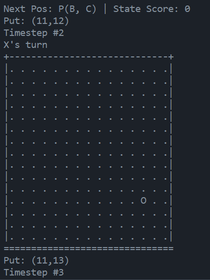
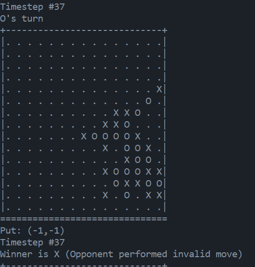

## Invalid Move

> First Hand: ./player_my 

> Second Hand: ./baseline2



```bash
Next Pos: P(B, C) | State Score: 0
Put: (11,12)
Timestep #2
X's turn
+-----------------------------+
|. . . . . . . . . . . . . . .|
|. . . . . . . . . . . . . . .|
|. . . . . . . . . . . . . . .|
|. . . . . . . . . . . . . . .|
|. . . . . . . . . . . . . . .|
|. . . . . . . . . . . . . . .|
|. . . . . . . . . . . . . . .|
|. . . . . . . . . . . . . . .|
|. . . . . . . . . . . . . . .|
|. . . . . . . . . . . . . . .|
|. . . . . . . . . . . . . . .|
|. . . . . . . . . . . . O . .|
|. . . . . . . . . . . . . . .|
|. . . . . . . . . . . . . . .|
|. . . . . . . . . . . . . . .|
===============================
```



```bash
Timestep #37
O's turn
+-----------------------------+
|. . . . . . . . . . . . . . .|
|. . . . . . . . . . . . . . .|
|. . . . . . . . . . . . . . .|
|. . . . . . . . . . . . . . .|
|. . . . . . . . . . . . . . X|
|. . . . . . . . . . . . . O .|
|. . . . . . . . . . X X O . .|
|. . . . . . . . . X X O . . .|
|. . . . . . . X O O O O X . .|
|. . . . . . . . . X . O O X .|
|. . . . . . . . . . . X O O .|
|. . . . . . . . . X O O O X X|
|. . . . . . . . . . O X X O O|
|. . . . . . . . . X . O . X X|
|. . . . . . . . . . . . . . .|
===============================
Put: (-1,-1)
```

Segmentation Fault

```
1
0 0 0 0 0 0 0 0 0 0 0 0 0 0 0
0 0 0 0 0 0 0 0 0 0 0 0 0 0 0
0 0 0 0 0 0 0 0 0 0 0 0 0 0 0
0 0 0 0 0 0 0 0 0 0 0 0 0 0 0
0 0 0 0 0 0 0 0 0 0 0 0 0 0 0
0 0 0 0 0 0 0 0 0 0 0 0 0 0 0
0 0 0 0 0 0 0 0 0 0 0 0 0 0 0
0 0 0 0 0 0 0 0 0 0 0 0 0 0 0
0 0 0 0 0 0 2 2 0 0 0 1 0 0 0
0 0 0 0 0 0 1 1 0 1 2 0 0 0 0
0 0 0 0 0 1 0 2 1 2 0 1 0 0 0
0 0 0 0 1 0 2 2 2 1 1 2 0 0 0
0 0 0 1 0 0 1 2 2 2 0 1 0 0 0
0 0 2 0 0 0 1 0 2 0 2 0 0 0 0
0 0 0 0 0 0 0 0 0 0 0 1 0 0 0

```

# Bug Checking

```bash
./main ./baseline1 ./player_new
```

```bash
2
0 0 0 0 0 0 0 0 0 0 0 0 0 0 0
0 0 0 0 0 0 0 0 0 0 0 0 0 0 0
0 0 0 0 0 0 0 0 0 0 0 0 0 0 0
0 0 0 0 0 0 0 0 0 0 0 0 0 0 0
0 0 0 0 0 0 0 0 0 0 0 0 0 0 0
0 0 0 0 0 0 0 0 0 2 0 2 0 0 0
0 0 0 0 0 1 1 1 1 2 0 0 0 0 0
0 0 0 0 0 0 0 1 0 2 0 0 0 0 0
0 0 0 0 0 0 1 2 2 1 0 0 0 0 0
0 0 0 0 0 1 0 2 0 0 0 0 0 0 0
0 0 0 0 2 0 1 0 0 0 0 0 0 0 0
0 0 0 0 0 0 0 0 0 0 0 0 0 0 0
0 0 0 0 0 0 0 0 0 0 0 0 0 0 0
0 0 0 0 0 0 0 0 0 0 0 0 0 0 0
0 0 0 0 0 0 0 0 0 0 0 0 0 0 0
Timestep #19
Winner is X
+-----------------------------+
|. . . . . . . . . . . . . . .|
|. . . . . . . . . . . . . . .|
|. . . . . . . . . . . . . . .|
|. . . . . . . . . . . . . . .|
|. . . . . . . . . . . . . . .|
|. . . . . . . . . X . X . . .|
|. . . . . O O O O X X . . . .|
|. . . . . . . O . X . . . . .|
|. . . . . . O X X O . . . . .|
|. . . . . O . X . . . . . . .|
|. . . . X . O . . . . . . . .|
|. . . . . . . . . . . . . . .|
|. . . . . . . . . . . . . . .|
|. . . . . . . . . . . . . . .|
|. . . . . . . . . . . . . . .|
===============================
```

OR

```bash
2
0 0 0 0 0 0 0 0 0 0 0 0 0 0 0
0 0 0 0 0 0 0 0 0 0 0 0 0 0 0
0 0 0 0 0 0 0 0 0 0 0 0 0 0 0
0 0 0 0 0 0 0 0 0 0 0 0 0 0 0
0 0 0 0 0 0 0 0 0 0 2 0 0 0 0
0 0 0 0 0 0 1 0 0 1 0 0 0 0 0
0 0 0 0 0 0 1 0 1 0 1 0 0 0 0
0 0 0 0 0 0 1 1 2 2 0 0 0 0 0
0 0 0 0 0 0 1 0 2 0 0 0 0 0 0
0 0 0 0 0 2 2 2 1 0 0 0 0 0 0
0 0 0 0 0 0 0 0 0 0 0 0 0 0 0
0 0 0 0 0 2 0 0 0 0 0 0 0 0 0
0 0 0 0 0 0 0 0 0 0 0 0 0 0 0
0 0 0 0 0 0 0 0 0 0 0 0 0 0 0
0 0 0 0 0 0 0 0 0 0 0 0 0 0 0
Timestep #19
Winner is X
+-----------------------------+
|. . . . . . . . . . . . . . .|
|. . . . . . . . . . . . . . .|
|. . . . . . . . . . . . . . .|
|. . . . . . . . . . . . . . .|
|. . . . . . . . . . X . . . .|
|. . . . . . O . . O . . . . .|
|. . . . . . O . O . O . . . .|
|. . . . . . O O X X . . . . .|
|. . . . . . O . X . . . . . .|
|. . . . . X X X O . . . . . .|
|. . . . . . X . . . . . . . .|
|. . . . . X . . . . . . . . .|
|. . . . . . . . . . . . . . .|
|. . . . . . . . . . . . . . .|
|. . . . . . . . . . . . . . .|
===============================

```

OR

```bash
2
0 0 0 0 0 0 0 0 0 0 0 0 0 0 0
0 0 0 0 0 0 0 0 0 0 0 0 0 0 0
0 0 0 0 0 0 0 0 0 0 0 0 0 0 0
0 0 0 0 0 0 0 0 0 0 0 0 0 0 0
0 0 0 0 0 0 0 0 0 0 0 0 0 0 0
0 0 0 0 0 0 1 0 0 0 0 0 0 0 0
0 0 0 0 0 1 2 1 1 1 0 0 0 0 0
0 0 0 0 0 1 2 1 2 0 0 0 0 0 0
0 0 0 0 0 1 2 2 2 1 0 0 0 0 0
0 0 0 0 0 2 2 2 2 1 0 0 0 0 0
0 0 0 0 0 0 1 0 2 0 0 0 0 0 0
0 0 0 0 0 0 0 0 1 0 0 0 0 0 0
0 0 0 0 0 0 0 0 0 0 0 0 0 0 0
0 0 0 0 0 0 0 0 0 0 0 0 0 0 0
0 0 0 0 0 0 0 0 0 0 0 0 0 0 0
Timestep #25
Winner is X
+-----------------------------+
|. . . . . . . . . . . . . . .|
|. . . . . . . . . . . . . . .|
|. . . . . . . . . . . . . . .|
|. . . . . . . . . . . . . . .|
|. . . . . . . . . . . . . . .|
|. . . . . . O . . . . . . . .|
|. . . . . O X O O O . . . . .|
|. . . . . O X O X . . . . . .|
|. . . . . O X X X O . . . . .|
|. . . . X X X X X O . . . . .|
|. . . . . . O . X . . . . . .|
|. . . . . . . . O . . . . . .|
|. . . . . . . . . . . . . . .|
|. . . . . . . . . . . . . . .|
|. . . . . . . . . . . . . . .|
===============================

```

OR

```bash
2
0 0 0 0 0 0 0 0 0 0 0 0 0 0 0
0 0 0 0 0 0 0 0 0 0 0 0 0 0 0
0 0 0 0 0 0 0 0 0 0 0 0 0 0 0
0 0 0 0 0 0 0 0 0 0 0 0 0 0 0
0 0 0 0 0 0 0 0 0 0 0 0 0 0 0
0 0 0 0 1 0 2 0 0 0 0 0 0 0 0
0 0 0 0 0 2 2 1 1 0 0 0 0 0 0
0 0 0 0 0 0 2 1 0 0 0 0 0 0 0
0 0 0 0 0 1 2 2 2 1 0 0 0 0 0
0 0 0 0 0 0 1 0 1 0 0 0 0 0 0
0 0 0 0 0 0 0 0 0 0 0 0 0 0 0
0 0 0 0 0 0 0 0 0 0 0 0 0 0 0
0 0 0 0 0 0 0 0 0 0 0 0 0 0 0
0 0 0 0 0 0 0 0 0 0 0 0 0 0 0
0 0 0 0 0 0 0 0 0 0 0 0 0 0 0
Timestep #17
Winner is X
+-----------------------------+
|. . . . . . . . . . . . . . .|
|. . . . . . . . . . . . . . .|
|. . . . . . . . . . . . . . .|
|. . . . . . . . . . . . . . .|
|. . . . . . X . . . . . . . .|
|. . . . O . X . . . . . . . .|
|. . . . . X X O O . . . . . .|
|. . . . . . X O . . . . . . .|
|. . . . . O X X X O . . . . .|
|. . . . . . O . O . . . . . .|
|. . . . . . . . . . . . . . .|
|. . . . . . . . . . . . . . .|
|. . . . . . . . . . . . . . .|
|. . . . . . . . . . . . . . .|
|. . . . . . . . . . . . . . .|
===============================
```

OR

```bash
2
0 0 0 0 0 0 0 0 0 0 0 0 0 0 0
0 0 0 0 0 0 0 0 0 0 0 0 0 0 0
0 0 0 0 0 0 0 0 0 0 0 0 0 0 0
0 0 0 0 1 0 0 0 0 0 0 0 0 0 0
0 0 0 0 0 2 0 0 0 0 0 0 0 0 0
0 0 0 0 0 2 2 0 1 0 0 0 0 0 0
0 0 0 0 1 2 2 2 2 1 0 0 0 0 0
0 0 0 0 0 2 1 1 2 0 1 0 0 0 0
0 0 0 0 0 1 1 0 2 1 0 0 0 0 0
0 0 0 0 0 0 0 0 1 0 0 0 0 0 0
0 0 0 0 0 0 0 0 0 0 0 0 0 0 0
0 0 0 0 0 0 0 0 0 0 0 0 0 0 0
0 0 0 0 0 0 0 0 0 0 0 0 0 0 0
0 0 0 0 0 0 0 0 0 0 0 0 0 0 0
0 0 0 0 0 0 0 0 0 0 0 0 0 0 0
Timestep #23
Winner is X
+-----------------------------+
|. . . . . . . . . . . . . . .|
|. . . . . . . . . . . . . . .|
|. . . . . . . . . . . . . . .|
|. . . . O X . . . . . . . . .|
|. . . . . X . . . . . . . . .|
|. . . . . X X . O . . . . . .|
|. . . . O X X X X O . . . . .|
|. . . . . X O O X . O . . . .|
|. . . . . O O . X O . . . . .|
|. . . . . . . . O . . . . . .|
|. . . . . . . . . . . . . . .|
|. . . . . . . . . . . . . . .|
|. . . . . . . . . . . . . . .|
|. . . . . . . . . . . . . . .|
|. . . . . . . . . . . . . . .|
===============================
```

OR

```bash
2
0 0 0 0 0 0 0 0 0 0 0 0 0 0 0
0 0 0 0 0 0 0 0 0 0 0 0 0 0 0
0 0 0 0 0 0 0 0 0 0 0 0 0 0 0
0 0 0 0 0 0 0 0 0 0 0 0 0 0 0
0 0 0 0 0 0 0 0 0 0 0 0 0 0 0
0 0 0 0 0 0 1 1 1 2 0 0 0 0 0
0 0 0 0 0 1 2 2 2 2 1 0 0 0 0
0 0 0 0 0 0 1 1 2 2 0 0 0 0 0
0 0 0 0 0 0 1 2 2 2 2 1 0 0 0
0 0 0 0 0 0 1 0 1 1 0 0 0 0 0
0 0 0 0 0 0 0 0 0 0 0 0 0 0 0
0 0 0 0 0 0 0 0 0 0 0 0 0 0 0
0 0 0 0 0 0 0 0 0 0 0 0 0 0 0
0 0 0 0 0 0 0 0 0 0 0 0 0 0 0
0 0 0 0 0 0 0 0 0 0 0 0 0 0 0
Timestep #25
Winner is X
+-----------------------------+
|. . . . . . . . . . . . . . .|
|. . . . . . . . . . . . . . .|
|. . . . . . . . . . . . . . .|
|. . . . . . . . . . . . . . .|
|. . . . . . . . . X . . . . .|
|. . . . . . O O O X . . . . .|
|. . . . . O X X X X O . . . .|
|. . . . . . O O X X . . . . .|
|. . . . . . O X X X X O . . .|
|. . . . . . O . O O . . . . .|
|. . . . . . . . . . . . . . .|
|. . . . . . . . . . . . . . .|
|. . . . . . . . . . . . . . .|
|. . . . . . . . . . . . . . .|
|. . . . . . . . . . . . . . .|
===============================
```

OR

```bash
2
0 0 0 0 0 0 0 0 0 0 0 0 0 0 0
0 0 0 0 0 0 0 0 0 0 0 0 0 0 0
0 0 0 0 0 0 0 0 0 0 0 0 0 0 0
0 0 0 0 0 0 0 0 0 0 0 0 0 0 0
0 0 0 0 0 0 0 0 0 0 0 0 0 0 0
0 0 0 0 0 0 2 1 0 0 0 0 0 0 0
0 0 0 0 0 0 0 1 1 0 2 2 0 0 0
0 0 0 0 0 0 2 1 1 1 1 2 0 0 0
0 0 0 0 0 0 0 2 2 1 1 0 0 0 0
0 0 0 0 0 0 0 0 1 2 1 2 0 0 0
0 0 0 0 0 0 0 1 0 0 1 2 0 0 0
0 0 0 0 0 0 2 0 0 0 2 0 0 0 0
0 0 0 0 0 0 0 0 0 0 0 0 0 0 0
0 0 0 0 0 0 0 0 0 0 0 0 0 0 0
0 0 0 0 0 0 0 0 0 0 0 0 0 0 0
Timestep #27
Winner is X
+-----------------------------+
|. . . . . . . . . . . . . . .|
|. . . . . . . . . . . . . . .|
|. . . . . . . . . . . . . . .|
|. . . . . . . . . . . . . . .|
|. . . . . . . . . . . . . . .|
|. . . . . . X O . . . . . . .|
|. . . . . . . O O . X X . . .|
|. . . . . . X O O O O X . . .|
|. . . . . . . X X O O X . . .|
|. . . . . . . . O X O X . . .|
|. . . . . . . O . . O X . . .|
|. . . . . . X . . . X . . . .|
|. . . . . . . . . . . . . . .|
|. . . . . . . . . . . . . . .|
|. . . . . . . . . . . . . . .|
===============================
```

OR

```bash
2
0 0 0 0 0 0 0 0 0 0 0 0 0 0 0
0 0 0 0 0 0 0 0 0 0 0 0 0 0 0
0 0 0 0 0 0 0 0 0 0 0 0 0 0 0
0 0 0 0 0 0 0 0 0 0 0 0 0 0 0
0 0 0 0 0 0 0 0 0 0 0 0 0 0 0
0 0 0 0 0 0 0 0 1 2 0 0 0 0 0
0 0 0 0 2 2 0 1 1 0 0 0 0 0 0
0 0 0 0 2 1 1 1 1 2 0 0 0 0 0
0 0 0 0 0 1 1 2 2 0 0 0 0 0 0
0 0 0 0 2 1 2 1 0 0 0 0 0 0 0
0 0 0 0 2 1 0 0 1 0 0 0 0 0 0
0 0 0 0 0 2 0 0 0 2 0 0 0 0 0
0 0 0 0 0 0 0 0 0 0 0 0 0 0 0
0 0 0 0 0 0 0 0 0 0 0 0 0 0 0
0 0 0 0 0 0 0 0 0 0 0 0 0 0 0
Timestep #27
Winner is X
+-----------------------------+
|. . . . . . . . . . . . . . .|
|. . . . . . . . . . . . . . .|
|. . . . . . . . . . . . . . .|
|. . . . . . . . . . . . . . .|
|. . . . . . . . . . . . . . .|
|. . . . . . . . O X . . . . .|
|. . . . X X . O O . . . . . .|
|. . . . X O O O O X . . . . .|
|. . . . X O O X X . . . . . .|
|. . . . X O X O . . . . . . .|
|. . . . X O . . O . . . . . .|
|. . . . . X . . . X . . . . .|
|. . . . . . . . . . . . . . .|
|. . . . . . . . . . . . . . .|
|. . . . . . . . . . . . . . .|
===============================
```

```bash
2
0 0 0 0 0 0 0 0 0 0 0 0 0 0 0
0 0 0 0 0 0 0 0 0 0 0 0 0 0 0
0 0 0 0 0 0 0 0 0 0 0 0 0 0 0
0 0 0 0 0 0 0 0 0 0 0 0 0 0 0
0 0 0 0 0 0 0 0 0 0 0 0 0 0 0
0 0 0 0 0 0 0 0 0 0 0 0 0 0 0
0 0 0 0 0 2 0 2 0 0 0 2 0 0 0
0 0 0 0 0 1 1 1 2 0 1 0 0 0 0
0 0 0 0 0 0 1 1 2 1 0 0 0 0 0
0 0 0 0 0 0 0 1 1 2 0 0 0 0 0
0 0 0 0 0 0 2 1 1 1 1 2 0 0 0
0 0 0 0 0 0 2 2 0 2 2 0 0 0 0
0 0 0 0 0 0 0 0 0 0 0 0 0 0 0
0 0 0 0 0 0 0 0 0 0 0 0 0 0 0
0 0 0 0 0 0 0 0 0 0 0 0 0 0 0
Timestep #27
Winner is X
+-----------------------------+
|. . . . . . . . . . . . . . .|
|. . . . . . . . . . . . . . .|
|. . . . . . . . . . . . . . .|
|. . . . . . . . . . . . . . .|
|. . . . . . . . . . . . . . .|
|. . . . . . . . . . . . . . .|
|. . . . . X . X . . . X . . .|
|. . . . . O O O X . O . . . .|
|. . . . . . O O X O . . . . .|
|. . . . . . . O O X . . . . .|
|. . . . . . X O O O O X . . .|
|. . . . . . X X X X X . . . .|
|. . . . . . . . . . . . . . .|
|. . . . . . . . . . . . . . .|
|. . . . . . . . . . . . . . .|
===============================
```

```bash
./main ./baseline2 ./player_new
```

```bash
2
0 0 0 0 0 0 0 0 0 0 0 0 0 0 0
0 0 0 0 0 0 0 0 0 0 0 0 0 0 0
0 0 0 0 0 0 0 0 0 0 0 0 0 0 0
0 0 0 0 0 0 0 0 0 0 0 0 0 0 0
0 0 0 0 0 0 2 0 0 0 0 0 0 0 0
0 0 0 0 0 2 0 2 0 0 0 0 0 0 0
0 0 0 0 2 1 0 0 2 0 0 0 0 0 0
0 0 0 1 2 1 1 1 1 2 0 0 0 0 0
0 0 0 0 0 1 1 2 2 0 1 0 0 0 0
0 0 0 0 0 1 2 1 0 0 0 0 0 0 0
0 0 0 0 1 2 0 0 1 0 0 0 0 0 0
0 0 0 2 1 0 0 0 0 2 0 0 0 0 0
0 0 0 0 0 0 0 0 0 0 0 0 0 0 0
0 0 0 0 0 0 0 0 0 0 0 0 0 0 0
0 0 0 0 0 0 0 0 0 0 0 0 0 0 0
Timestep #29
Winner is X
+-----------------------------+
|. . . . . . . . . . . . . . .|
|. . . . . . . . . . . . . . .|
|. . . . . . . . . . . . . . .|
|. . . . . X . . . . . . . . .|
|. . . . . . X . . . . . . . .|
|. . . . . X . X . . . . . . .|
|. . . . X O . . X . . . . . .|
|. . . O X O O O O X . . . . .|
|. . . . . O O X X . O . . . .|
|. . . . . O X O . . . . . . .|
|. . . . O X . . O . . . . . .|
|. . . X O . . . . X . . . . .|
|. . . . . . . . . . . . . . .|
|. . . . . . . . . . . . . . .|
|. . . . . . . . . . . . . . .|
===============================

```