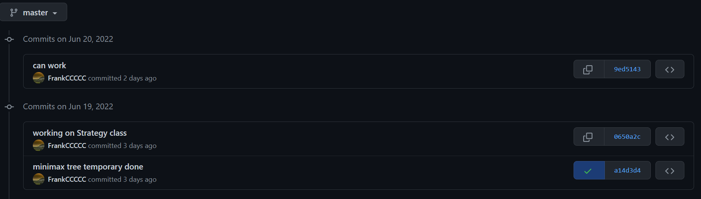
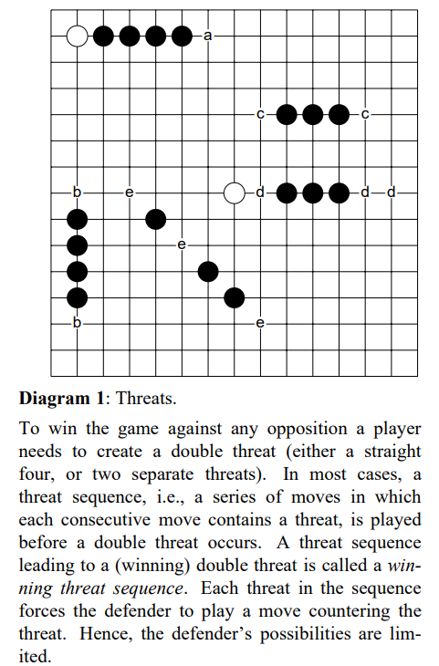
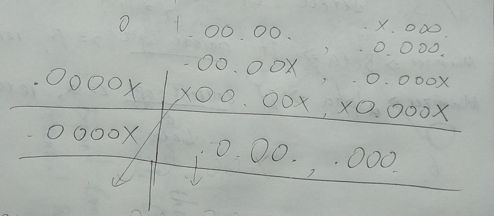
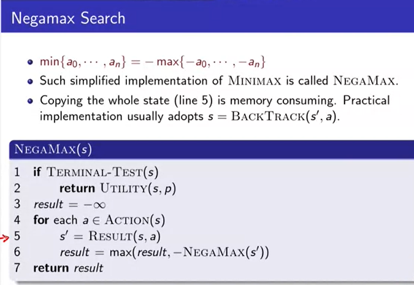
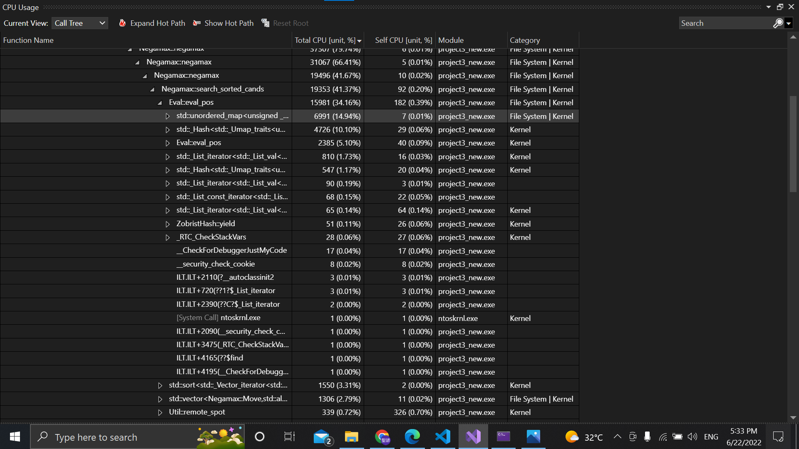
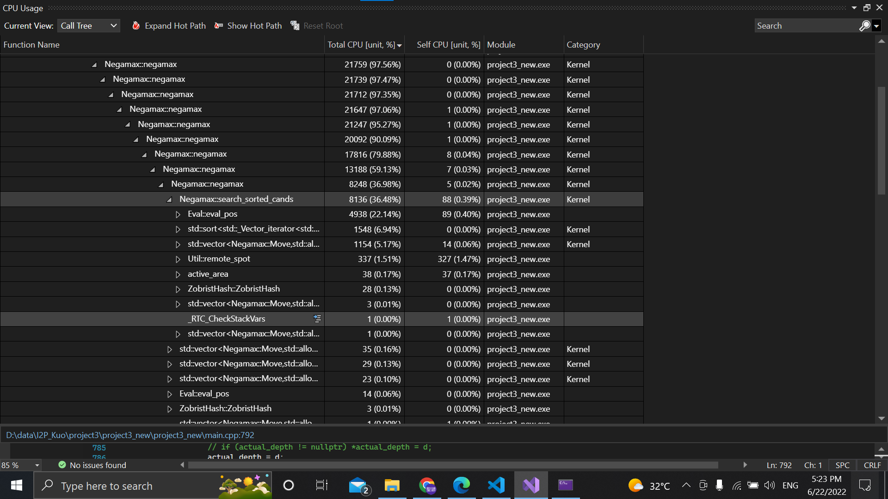
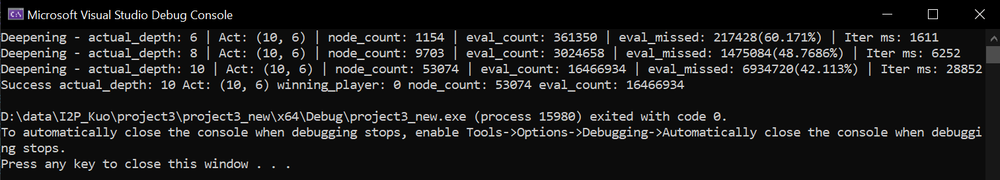
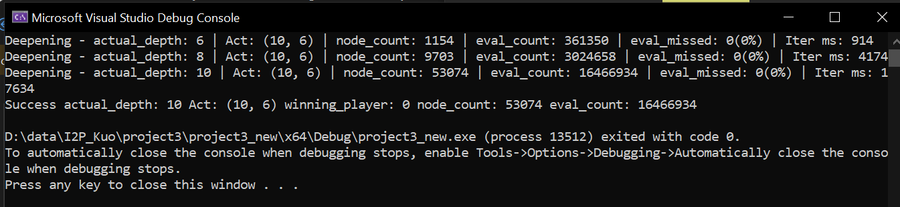

# Gomoku AI

## Github



## Threat Space Search

Refers to [Go-Moku and Threat-Space Search, 1994, L.V. Allis et.al](https://www.researchgate.net/publication/2252447_Go-Moku_and_Threat-Space_Search)

In some case, if you don't defense, then you will die unless you can get 5 in a row in 1 move.



If you want to win, you need to pose double threats. In the ver1, I design a class ``state`` to record the board, state value and the candidates. But it's too slow to allocate a string.

Scan opponent's move to see whether the opponent poses a threat or not. If the opponent poses a threat, search that candidate move first(push the move into the head)

```cpp
bool block_opponent = false;
int tmp_size = std::min(static_cast<int>(moves_opponent.size()), 2);
if (moves_opponent[0].score >= THRAT_SCORE_LIMIT) {
	block_opponent = true;
	for (int i = 0; i < tmp_size; ++i) {
		auto move = moves_opponent[i];

		// Re-evaluate move as current player
		move.score = Eval::eval_pos(state, move.r, move.c, player);

		// Add to candidate list
		candidate_moves.push_back(move);
	}
}
```

## State Value Function

Since we know re-evaluate a state(whole board) is expensive and in evaluation, we actually compute the the same area, I design the state value function that only count the difference of the board, which is the move of the AI and the opponent.

Each move will affect a star area nearby. So, I measure it in 4 directions, which are horizontal, vertical, diagonal directions.

```cpp
void Eval::gen_measures(const char *state, int r, int c, int player, bool is_cont, Eval::Measure *ms) {
    ERR_NULL_CHECK(state,)
    ERR_POS_CHECK(r,c,)

    // Scan 4 directions
    gen_measure(state, r, c, Eval::MEASURE_DIR_H, player, is_cont, ms[0]);
    gen_measure(state, r, c, Eval::MEASURE_DIR_LU, player, is_cont, ms[1]);
    gen_measure(state, r, c, Eval::MEASURE_DIR_V, player, is_cont, ms[2]);
    gen_measure(state, r, c, Eval::MEASURE_DIR_RU, player, is_cont, ms[3]);
}
```

Each time I record ``{Number of pieces in a row, Number of ends blocked by edge or the other player (0-2), Number of spaces in the middle of pattern}``

```cpp
// Result of a measurement in a direction
struct Measure {
	// Number of pieces in a row
	char len; 
	// Number of ends blocked by the other player (1 or 2) or the border of the board (-1: don't care the value)
	char block_cnt;
	// Number of empty spaces inside the row(number of pieces to separate the row,  -1: don't care the value)
	char space_cnt;
};
```

And I define the pattern as ``{Length of pattern (pieces in a row), Number of ends blocked by edge or the other player (0-2), Number of spaces in the middle of pattern (-1: Ignore value)}``

```cpp
// A pattern in a direction
struct Pattern {
	// Minimum count of occurrences
	char min_occur;
	// Length of a pattern (number of pieces in a row)
	char len;
	// Number of ends blocked by the other player (1 or 2) or the border of the board (-1: don't care the value)
	char block_cnt;
	// Number of empty spaces inside the row(number of pieces to separate the row,  -1: don't care the value)
	char space_cnt;
};
const Eval::Pattern *Eval::PATTERNS = new Eval::Pattern[PATTERNS_NUM * 2]{
        {1, 5,  0,  0}, {0, 0,  0,  0},  // 10000
        {1, 4,  0,  0}, {0, 0,  0,  0},  // 700
        // Threats-----------------------------
        {2, 4,  1,  0}, {0, 0,  0,  0},  // 700
        {2, 4, -1,  1}, {0, 0,  0,  0},  // 700
        {1, 4,  1,  0}, {1, 4, -1,  1},  // 700
        {1, 4,  1,  0}, {1, 3,  0, -1},  // 500
        {1, 4, -1,  1}, {1, 3,  0, -1},  // 500
        {2, 3,  0, -1}, {0, 0,  0,  0},  // 300
        // Threats-----------------------------
		...
```



Evaluate the given position

```cpp
int Eval::eval_pos(const char *state, int r, int c, int player) {
    // Check parameters
    ERR_NULL_CHECK(state, 0)
    ERR_PLAYER_CHECK(player, 0)

    Measure ms[M_DIR_NUM];

    // Measure continuous and non-continuous conditions
    gen_measures(state, r, c, player, false, ms);
    Score sc_non_conti = eval_measures(ms);
    gen_measures(state, r, c, player, true, ms);
    Score sc_conti = eval_measures(ms);
    return std::max(sc_non_conti, sc_conti);
}

int Eval::eval_measures(const Measure *measure_4d) {
    int sc = 0;

    // Find the longest length in measure_4d and skip some patterns that is longer than the Measure
    int max_measure_len = 0;
    for (int i = 0; i < M_DIR_NUM; i++) {
        int len = measure_4d[i].len;
        max_measure_len = max(len, max_measure_len);
        sc += (len - 1);
    }
    int start_pat_idx = SKIP_PATTERNS[max_measure_len];

    // Match specified patterns, ignore the patterns measures doesn't have
    for (int i = start_pat_idx; i < PATTERNS_NUM; i++) {
        sc += match_pattern(measure_4d, &PATTERNS[2 * i]) * PATTERN_SCORES[i];

        // Only match one threatening pattern
        if (sc >= THRAT_SCORE_LIMIT){break;}
    }

    return sc;
}
```

How I count the space and the block of a sequence

```cpp
for (int i = 0; i < 2; i++) {
	while (true) {
		// Shift
		r_cnt += dr; c_cnt += dc;

		// Validate position
		if (pos_check(r_cnt, c_cnt)){break;}

	// Get spot value
	int spot = state[_2d_1d(r_cnt, c_cnt)];

	// Empty spots
	if (spot == 0) {
		if (allowed_space > 0 && Util::get_spot(state, r_cnt + dr, c_cnt + dc) == player) {
			allowed_space--; 
			res.space_cnt++;
			continue;
		} else {
			res.block_cnt--;
			break;
		}
	}

	// Another player
	if (spot != player){break;}

	// Current player
	res.len++;
}

// Reverse direction
dr = -dr; 
dc = -dc;
r_cnt = r; 
c_cnt = c;
}
```

Accumulate the scores along trajectory. Because the ``Negamax::negamax`` will return opponent's score(score of opponent's utility), we need to minus it.

```cpp
if (depth > 1) sc = negamax(state, opn, initial_depth, depth - 1, enable_ab_pruning, -beta, -alpha, dummy_r, dummy_c);

// Decay longer moves
sc = static_cast<int>(sc * SCORE_DECAY);

// Calculate score difference
move.accum_score = move.score - sc;

// Store back to candidate array
cand_mvs.at(i).accum_score = move.accum_score;
```

## Minimax & Alpha-Beta Pruning (Negamax)

It's just another implementation of Minimax. It's based on the following formula

$$
\max(a, b) = -\min(-a, -b)
$$



Pseudo code

```
function negamax(node, depth, color) is
    if depth = 0 or node is a terminal node then
        return color × the heuristic value of node
    value := −∞
    for each child of node do
        value := max(value, −negamax(child, depth − 1, −color))
    return value
```

### Negamax with alpha-beta pruning 

Pseudo code

```
function negamax(node, depth, α, β, color) is
    if depth = 0 or node is a terminal node then
        return color × the heuristic value of node

    childNodes := generateMoves(node)
    childNodes := orderMoves(childNodes)
    value := −∞
    foreach child in childNodes do
        value := max(value, −negamax(child, depth − 1, −β, −α, −color))
        α := max(α, value)
        if α ≥ β then
            break (* cut-off *)
    return value
```

```cpp
sc = negamax(state,                 
			opponent,           // Change player
			initial_depth,      // Initial depth
			depth - 1,          // Reduce depth by 1
			enable_ab_pruning,  // Alpha-Beta
			-beta,              //
			-alpha,
			move_r,            // Result move
			move_c);

// Store back to candidate array
cand_mvs.at(i).accum_score = move.accum_score;

// Restore the move
Util::set_spot(state, move.r, move.c, 0);

// Update maximum score
if (move.accum_score > max_score) {
	max_score = move.accum_score;
	move_r = move.r; move_c = move.c;
}

// Alpha-beta
if (max_score > alpha) alpha = max_score;
if (enable_ab_pruning && alpha >= beta) break;
```

## Iterative Deepening

Re-search the game tree deeper when the time is enough

```cpp
for (int d = INIT_DEPTH;; d += INC_DEPTH) {
	// Reset game state
	memcpy(ng_state, state, G_B_AREA);

	// Execute search
	negamax(ng_state, player, d, d, enable_ab_pruning, alpha, beta, move_r, move_c);
	actual_depth = d;
	INFO("Deepening - actual_depth: " << actual_depth << " Act: (" << move_r << ", " << move_c << ")" << " node_count: " << g_node_cnt << " eval_count: " << g_eval_cnt)
	io.write_valid_spot(Position(move_r, move_c));
}
```

## Zobrist Hash

I've tried to cache the searched state in a hash table with Zobrist hashing as the key. However, the ``operator[]`` and ``find()`` takes too much time to insert and check whether the key is in the table or not. Although it reduce the time of the ``eval_pos()`` but it takes much more time to handling the hash table. The first figure is the profiling of the hash table caching and the second one is the one without hash table.





I've also measure the hit rate of the hash table, it shows that about 60% of queries are missed in the shallower depth but only 40% of queries are missed in the deeper depth. As a result, the hash table may yield benefit in the deeper game tree. But consider the constraint of the project, we only have 10s. The hash table cannot help.





```cpp
ZobristHash::ZobristHash(const char *state) {
    this->state_hash = ZobristHash::zobrist_hash(state);
}
    
ZobristHash::ClassInit::ClassInit() {
    // Static constructor definition
    std::random_device rd;
    std::mt19937 gen(rd());
    std::uniform_int_distribution<ZbsHash> d(0, UINT64_MAX);

    ZobristHash::HASH_O = new ZbsHash[G_B_AREA];
    ZobristHash::HASH_X = new ZbsHash[G_B_AREA];
    ZobristHash::HASH_R = new ZbsHash[G_B_SIZE];
    ZobristHash::HASH_C = new ZbsHash[G_B_SIZE];
    ZobristHash::HASH_ROLE = new ZbsHash[ROLE_NUM];

    // Generate random values
    for (int i = 0; i < G_B_AREA; i++) {
        ZobristHash::HASH_O[i] = d(gen);
        ZobristHash::HASH_X[i] = d(gen);
    }
    for (int i = 0; i < G_B_SIZE; i++) {
        ZobristHash::HASH_R[i] = d(gen);
        ZobristHash::HASH_C[i] = d(gen);
    }
    for(int i = 0; i < ROLE_NUM; i++){
        ZobristHash::HASH_ROLE[i] = d(gen);
    }
}

ZbsHash ZobristHash::zobrist_hash(const char *state) {
    ZbsHash h = 0;
    for (int i = 0; i < G_B_AREA; i++) {
        if (state[i] == 1) { h ^= HASH_O[i]; }
        else if (state[i] == 2) { h ^= HASH_X[i]; }
    }
    return h;
}
Hash ZobristHash::hash(const char *state, int r, int c, int player) {
    Hash h = ZobristHash::zobrist_hash(state);
    h ^= (ZobristHash::HASH_R[r] ^ ZobristHash::HASH_C[c] ^ ZobristHash::HASH_ROLE[player]);
    return h;
}
Hash ZobristHash::yield(int r, int c, int player) const {
    return this->state_hash ^ (ZobristHash::HASH_R[r] ^ ZobristHash::HASH_C[c] ^ ZobristHash::HASH_ROLE[player]);
}
std::string hash_str(const char *state, int r, int c, int player) {
    char rc = (r + '0');
    char cc = (c + '0');
    char pc = (player + '0');
    return std::string(state) + rc + cc + pc;
}
// ZbsHash *ZobristHash::HASH_O, *ZobristHash::HASH_X;
ZbsHash *ZobristHash::HASH_O, *ZobristHash::HASH_X, *ZobristHash::HASH_R, *ZobristHash::HASH_C, *ZobristHash::HASH_ROLE;
ZobristHash::ClassInit ZobristHash::Initialize;
```

## Performance Issue

- Allocate ``std::string``/ append string are very expensive(half of runtime in ver1)
- Allocate class instance is much more expensive
- Use structure, inline function, static method and static variables as much as possible

## Reference

- Pandoc compile command

```bash
pandoc -o readme.pdf readme.md --pdf-engine=xelatex -V CJKmainfont="Microsoft JhengHei" --from markdown --template eisvogel --listings --toc --toc-depth=4
```